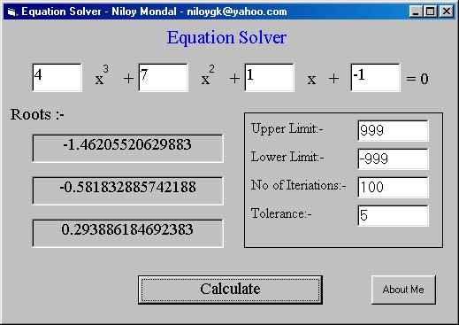



## ^Equation Solver^

### Description

This program can find roots of quadratic or cubic equations. The program can also be used to find the cube root or square root of a function. The program uses Bisectional method, it is explained in a text file.
 
### More Info
 

             |
---                |---
**Submitted On**   |2002-08-15 21:52:04
**By**             |[Niloy Mondal](https://github.com/Planet-Source-Code/PSCIndex/blob/master/ByAuthor/niloy-mondal.md)
**Level**          |Beginner
**User Rating**    |4.3 (17 globes from 4 users)
**Compatibility**  |VB 6\.0
**Category**       |[Math/ Dates](https://github.com/Planet-Source-Code/PSCIndex/blob/master/ByCategory/math-dates__1-37.md)
**World**          |[Visual Basic](https://github.com/Planet-Source-Code/PSCIndex/blob/master/ByWorld/visual-basic.md)
**Archive File**   |[^Equation\_1490191112002\.zip](https://github.com/Planet-Source-Code/niloy-mondal-equation-solver__1-40316/archive/master.zip)

